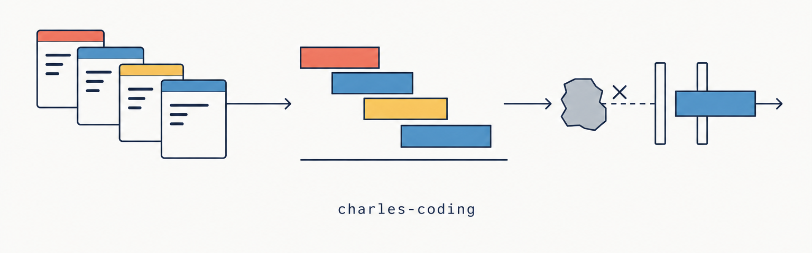

<div align="center">



     

</div>

一套给 AI 编程工具使用的全栈编码规范，以 Skill 形式分发，适用于 Claude Code、Codex、Cursor、Gemini CLI 等主流工具。

覆盖 Java / Kotlin / Python / Go / TypeScript / JavaScript / HTML / CSS / SQL / Node.js / Vue 3 / React / Android / Web 前端，内容包括分层架构与解耦、命名与注释、变更类型闸门、测试要求、Git 分支与交付规范，并附带一个违规即 fail 的规范校验器。

## 适用范围

这是作者 Charles 在自己项目中使用的规范，开源出来供直接使用或 fork 后调整。其中有几条偏好比较强，使用前请先确认能接受：

- 注释、文档与 AI 的交流语言一律为简体中文
- 缩进默认 Tab（Python / Kotlin 4 空格，SQL / YAML / JSON 2 空格）
- 集合处理一律写显式循环，禁止推导式、Stream 与集合回调链
- AI 只提交到 `agents/feature/*` 分支，由人工审查后合并
- 新功能编码前必须先写模块文档并评审，交付时必须带压测脚本

不同意其中某条时，fork 后修改对应规则模块即可，见 [自定义](#自定义)。

## 组成

七个 skill：一个规范本体，加六个场景工作流。

| skill | 用途 |
| --- | --- |
| `charles-coding-standards` | 规范本体：交付红线、场景路由、规范模块索引 |
| `charles-coding-new-project` | 新项目初始化：复制脚手架、装校验器、确认闸门确实会 fail |
| `charles-coding-legacy-project` | 老项目接入：增量检查，新代码严格、存量不阻塞 |
| `charles-coding-new-feature` | 新功能与需求变更：问清需求、模块文档评审、编码、测试 |
| `charles-coding-bugfix` | Bug 修复：定位根因、先写复现测试、再改实现 |
| `charles-coding-refactor` | 重构：证明行为等价，禁止改断言让它通过 |
| `charles-coding-review` | 代码审查：先跑校验器，再审脚本查不了的部分 |

## 安装

先把仓库克隆到本地：

```bash
git clone https://github.com/CharlesHYF/charles-coding-skill.git ~/charles-coding-skill
```

### Claude Code / Codex / Qoder / Trae / Rovo Dev

安装脚本把七个 skill 以软链形式装进目标工具的 skills 目录，不传参数时装到 Claude Code：

```bash
bash ~/charles-coding-skill/tools/install-skills.sh
```

其他工具把目标 skills 目录作为参数传入：

```bash
bash ~/charles-coding-skill/tools/install-skills.sh ~/.agents/skills    # Codex / Qoder / Trae 的跨工具标准位置
bash ~/charles-coding-skill/tools/install-skills.sh ~/.trae/skills      # Trae 专属路径，优先级高于 .agents
bash ~/charles-coding-skill/tools/install-skills.sh ~/.rovodev/skills   # Rovo Dev
```

遇到同名的实体目录时脚本会跳过，不会覆盖。装完的目录如下：

```
~/.claude/skills/
├── charles-coding-standards        -> ~/charles-coding-skill/skills/charles-coding-standards
├── charles-coding-new-project      -> ...
├── charles-coding-legacy-project   -> ...
├── charles-coding-new-feature      -> ...
├── charles-coding-bugfix           -> ...
├── charles-coding-refactor         -> ...
└── charles-coding-review           -> ...
```

只想在某个项目里启用时，把目标改成 `<项目>/.agents/skills` 或 `<项目>/.claude/skills`。项目级与用户级同名时，项目级优先。

### Claude Code plugin 方式

仓库自带 `.claude-plugin/marketplace.json`，也可以按 plugin 安装，调用形式变为 `/charles-coding:charles-coding-bugfix`：

```
/plugin marketplace add ~/charles-coding-skill
/plugin install charles-coding@charles-coding
```

软链方式和 plugin 方式只装一种，两种都装会出现同名 skill。

### Gemini CLI

```bash
git clone https://github.com/CharlesHYF/charles-coding-skill.git ~/.gemini/extensions/charles-coding
```

扩展清单是仓库根目录的 `gemini-extension.json`，上下文文件是 `AGENTS.md`。

### Cursor

```bash
git clone https://github.com/CharlesHYF/charles-coding-skill.git .cursor/plugins/charles-coding
```

### 其他工具

不支持 skill 目录的工具，把 `skills/charles-coding-standards/SKILL.md` 的内容作为 system prompt 注入即可。

## 更新

```bash
cd ~/charles-coding-skill && git pull origin main
```

软链方式下 pull 完立即生效，不需要重新运行安装脚本。只有仓库路径变化时才需要重新安装。

## 使用

装好后不需要额外操作。AI 工具会根据 skill 的 description 自动匹配场景，也可以手动调用，例如在 Claude Code 中输入 `/charles-coding-bugfix`。

新项目从脚手架开始，老项目安装增量校验器：

```bash
# 新项目：复制脚手架
cp -r ~/charles-coding-skill/templates/project-template/ <新项目路径>

# 老项目：安装增量校验器与 pre-push 钩子
bash ~/charles-coding-skill/tools/install-check.sh <项目路径>
```

老项目接入后默认只检查本次改动，存量违规不阻塞交付，新增代码按完整标准执行。详细步骤见 [charles-coding-legacy-project](skills/charles-coding-legacy-project/SKILL.md)。

开始编码前，AI 会检查项目里是否有 CI 配置。没有时会问一次是否需要，回答"不需要"后会记进项目的 `AGENTS.md`，之后的会话不再重复询问。

## 规范校验器

`tools/check.sh` 把规范里能机器判定的规则做成检查，违规时退出码非 0，共十四项：

```bash
bash tools/check.sh --all        # 全量扫描
bash tools/check.sh --changed    # 只查本次改动（老项目与日常迭代用）
```

| 检查 | 内容 |
| --- | --- |
| 一 | 禁用字符（Unicode 引号、破折号、Emoji） |
| 二 | 源码文件头注释块（作用描述、创建日期、修改日期、全角冒号） |
| 三 | 项目必需文件与 `docs/modules/`、`test_cases/` 目录层级 |
| 四 | 命名（数据传输对象后缀、占位名、编号名、口语函数名） |
| 五 | 注释语法（块注释三段式、docstring 引号） |
| 六 | 注释篇幅（**硬上限 3 行**）与句子折断 |
| 七 | 注释黑话（隐喻与口语表达词表） |
| 八 | 模块访问边界（单一入口，读项目根 `.import-boundaries`） |
| 九 | 样式注释（`.css` / `.scss` 与 Vue `<style>` 块内禁止任何注释） |
| 十 | import 排版（`import type` 不得排在值 import 之前） |
| 十一 | 测试代码位置（前端集中放 `frontend/tests/`，不散落在源码目录旁） |
| 十二 | 压测脚本（`test_cases/stress/` 为空即视为未完成） |
| 十三 | 集合写法（推导式、Stream、集合回调链、嵌套三元；Python 走语法树识别） |
| 十四 | Python 函数类型注解（参数与返回类型都要写，没有返回值写 `-> None`） |

豁免分两级：文件级写进 `.checkignore`，行级在注释里加 `check-ignore` 标记。文档里的反例和测试 fixture 用它放行。

## 交付闸门

```
push agents/**   ->  pre-push 钩子跑增量校验
push main        ->  pre-push 钩子跑全量 make verify，不通过不允许推送
推到远端之后      ->  云端 CI 再检查一次
```

本地 pre-push 钩子负责拦截，云端 CI 用来兜住钩子被绕过或未安装的情况。钩子由 `scripts/setup.sh` 或 `tools/install-check.sh` 安装。

## Git 提交约定

规范对 AI 的提交行为有四条要求，细则见 [rules/git.md](skills/charles-coding-standards/rules/git.md)。

1. **分支**：AI 只能提交到 `agents/feature/<描述>` 分支，禁止直接推 `main`，也不发起 PR。合并由人工审查后完成。分支名不按变更类型细分，变更类型只决定要过哪些闸门。
2. **提交粒度**：一个任务、一个需求、一个问题对应一个 commit。重构与功能修改分开提交；纯格式化的批量改动单独提交，并把提交哈希登记进 `.git-blame-ignore-revs`。提交信息建议用 Conventional Commits。
3. **作者身份**：author 与 committer 必须是使用者本人在本机配置的 git 身份（`git config user.name` / `user.email`）。AI 不得把自己设为作者，也不得替换成别人的身份；本机未配置时 AI 会停下来请你配置。
4. **禁止 AI 署名**：提交信息里不得出现 `Co-Authored-By: Claude ...` 等 AI 联合署名 trailer，也不得出现 `Generated with ...` 这类生成声明。目的是让仓库的提交者与 contributor 列表里只有真人。

第 4 条有机器检查：脚手架和本仓的 CI 都带"提交信息扫描"任务，提交信息中出现 Claude / GPT / Copilot / Cursor / Gemini / Anthropic 相关的联合署名，或含有 Unicode 破折号、弯引号、Emoji 时，CI 会 fail。

## 核心约定速览

| 项目 | 规范 |
| --- | --- |
| 缩进 | Tab（Python / Kotlin 4 空格，SQL / YAML / JSON 2 空格） |
| 行尾 | 统一 LF |
| 大括号 | 控制流与函数体必须用 `{}`，前后留空行 |
| 常量 | 禁止魔法数字，必须定义为顶部具名常量 |
| 命名 | 见名知义；禁止占位名（`tmp` / `obj`）、编号名（`data1`）、拼音混拼（`getYonghu`）、隐喻口语名（`doIt`）；函数名 = 动词 + 名词，动词全项目统一 |
| 文件头 | 三行：第一行直接写具体职责（无前缀标签、句尾不加句号），第二三行 `创建日期：` / `修改日期：`，冒号必须中文全角 |
| 文件头描述 | 只写核心职责，禁止用 `--` 追加功能罗列；功能会变，描述跟着过期 |
| 注释篇幅 | 正文默认 1-2 行，**硬上限 3 行**（标签行不计入）；一条注释一行写完，禁止把一句话折断换行 |
| 注释语法 | 多行注释一律用块或文档注释，禁止连续多行 `//` / `#` 拼多行；Go 声明级注释按官方标准用 `//` |
| 注释措辞 | 动作加对象加必要条件，一句话说清；动作词全项目统一；禁止隐喻黑话；日志与用户可见文案同一套要求 |
| 分层架构 | 后端强制 Controller 到 Service 到 Repository，禁止跨层 |
| 单一入口 | 一项能力只暴露一个入口模块，底层实现不许被入口之外的地方直接 import；受保护关系写进 `.import-boundaries` |
| 样式注释 | `.css` / `.scss` 文件与 Vue `<style>` 块内不写任何注释，含文件头；意图由 class 名与自定义属性命名表达 |
| import 排版 | 顺序为第三方值 import、项目内值 import、全部 type import、常量，组间空一行；type 一律用 `import type` |
| 元素排版 | 属性各占一行、文本单独占一行、同级元素之间空一行；只有组件自闭合，原生 HTML 标签成对出现；数组相邻元素之间空一行，对象内键值对不空行 |
| 集合写法 | 集合的遍历、过滤、转换、汇总一律显式循环；禁止推导式、Stream、集合回调链与嵌套三元，JSX 渲染列表时单独一次 `.map` 除外 |
| Python 注解 | 函数的参数与返回类型都要写注解，没有返回值写 `-> None` |
| 前端结构 | `types` / `store` / `constants` 一律 `index.ts` 再导出、实体放 `modules/`；`permission` 放 `src/` 下；全局组件在 `main.ts` 注册 |
| 变更闸门 | 动手前先判定变更类型（新功能 / 需求变更 / Bug 修复 / 重构 / 依赖升级），按对应档执行文档与测试要求 |
| CI 检查 | 编码前确认项目有 CI；没有时问一次是否需要，答复记进 `AGENTS.md` |
| 模块文档 | `docs/modules/<系统模块>/<模块名>.md` 两级组织，新功能编码前先写文档并评审 |
| Bug 修复 | 先定位根因，**先写复现测试并确认它失败**，再改实现，测试保留进 `regression/` |
| 重构 | 必须证明行为等价，禁止修改断言、删用例、放宽阈值让它通过 |
| 测试目录 | `test_cases/<系统模块>/<测试类型>/` 两级组织 |
| 测试位置 | 测试代码集中放 `tests/`（前端 `frontend/tests/`），Go 与 Java / Kotlin 因构建工具强制而例外 |
| 压测 | 新功能必须提供压测脚本，覆盖写操作、列表分页、批量导入导出、核心读接口四类 |
| CI | push main 与 PR 走全量，push `agents/**` 走增量；校验范围为禁用字符/文件头/注释语法/注释篇幅/注释黑话/必需文件/命名/模块边界/样式注释/import 排版/测试位置/压测/集合写法/类型注解，外加提交信息扫描 |
| Git | 见 [Git 提交约定](#git-提交约定) |

完整细则见 [skills/charles-coding-standards/SKILL.md](skills/charles-coding-standards/SKILL.md)。

## 提高遵从率

Skill 靠 description 匹配触发，AI 有时会漏读。可以在 `~/.claude/settings.json` 配置 SessionStart hook，每次会话开始时注入一段固定提醒：

```json
{
  "hooks": {
    "SessionStart": [
      { "hooks": [ { "type": "command", "command": "cat ~/.claude/charles-coding-reminder.txt" } ] }
    ]
  }
}
```

`~/.claude/charles-coding-reminder.txt` 需要自己创建，内容示例：

```
本机所有编码项目遵循 charles-coding Skill：
1) 老项目若无 AGENTS.md，动手改代码前先确认需求并声明遵循规范；
2) 开发新功能/新模块前，先在 docs/modules/<模块>.md 写模块文档并经评审，通过后再编码；
3) 交付前测试必须实跑并全部通过。
```

配置后新开会话生效。

## 自定义

fork 后按需修改。规则按关注点拆在不同模块里，每条规则只写在一处：

| 想改的内容 | 修改位置 |
| --- | --- |
| 缩进、禁用符号、常量、集合写法 | `skills/charles-coding-standards/rules/common.md` |
| 命名 | `rules/naming.md` |
| 注释与文件头 | `rules/text.md` |
| 分支、提交、署名 | `rules/git.md` |
| 变更闸门、模块文档、CI 检查 | `rules/process.md` |
| 工作节奏与交流方式 | `rules/collaboration.md` |
| 某门语言或框架 | `languages/`、`stacks/` 下对应分册 |

部分规则同时出现在规则模块、项目模板 `AGENTS.md` 和校验器里，改了其中一处要同步其余几处，`tests/check_consistency.sh` 会检查。机器可判定的规则还要同步修改 `tools/check.sh` 和 `templates/project-template/scripts/check.sh`（两份必须一致）。

## 目录结构

```
.
├── skills/
│   ├── charles-coding-standards/     # 规范本体
│   │   ├── SKILL.md                  # 交付红线 + 场景路由 + 模块索引
│   │   ├── rules/                    # 通用规则，所有语言适用
│   │   │   ├── common.md             # 缩进、行尾、禁用符号、大括号、换行、常量、集合写法
│   │   │   ├── naming.md             # 变量、函数、布尔、集合、数据传输对象
│   │   │   ├── text.md               # 注释语法、文件头、篇幅、折行、措辞
│   │   │   ├── architecture.md       # 分层架构、解耦、单一入口、文件内组织
│   │   │   ├── git.md                # 提交、署名、分支、gitignore、交付整洁
│   │   │   ├── process.md            # 变更类型闸门、CI 检查、模块文档、子 Agent 契约
│   │   │   └── collaboration.md      # 工作节奏、确认边界、中文表达
│   │   ├── languages/                # java kotlin python go javascript-typescript html-css sql
│   │   ├── stacks/                   # vue react nodejs web android
│   │   └── domains/                  # testing logging devops ai-ml docs-markdown
│   ├── charles-coding-new-project/   # 六个场景工作流
│   ├── charles-coding-legacy-project/
│   ├── charles-coding-new-feature/
│   ├── charles-coding-bugfix/
│   ├── charles-coding-refactor/
│   └── charles-coding-review/
├── tools/
│   ├── check.sh                      # 规范校验器，十四项检查
│   ├── install-check.sh              # 老项目接入：装校验器与 pre-push 钩子
│   └── install-skills.sh             # 把七个 skill 软链到工具的 skills 目录
├── templates/
│   ├── project-template/             # 新项目脚手架，含 AGENTS.md、Makefile、CI
│   ├── module-doc.md                 # 模块文档模板
│   └── examples/                     # 测试用例与模块文档范例、前端范例页
├── docs/modules/                     # 本仓自身的模块文档
├── test_cases/                       # 本仓自身的测试用例文档
├── tests/                            # 本仓自测脚本（CI 强制）
├── .claude-plugin/ .codex-plugin/ .cursor-plugin/ .agents/   # 各工具的 plugin 清单
├── gemini-extension.json             # Gemini CLI 扩展清单
└── AGENTS.md                         # 修改本仓时 AI 读取的指令
```

## 参与贡献

欢迎提 Issue 和 PR。修改前先读 [AGENTS.md](AGENTS.md)，本仓自身也遵守这套规范。提交前跑通以下四项，CI 会在 push 和 PR 时执行同样的检查：

```bash
bash tests/run_tests.sh          # check.sh 回归测试，既测该报的都报，也测不该报的不报
bash tests/check_consistency.sh  # 多处同源规则的一致性
bash tests/check_structure.sh    # skill 完整性、版本号一致、Markdown 死链
bash tools/check.sh --all        # 本仓自身的规范校验
```

## 许可证

[MIT](LICENSE) © 2026 Charles
