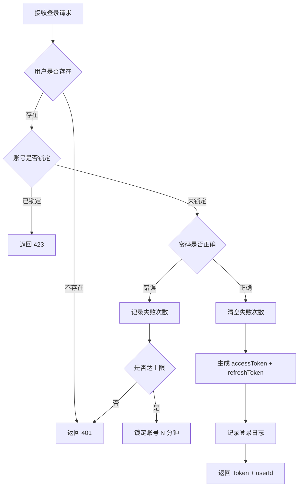

# 认证模块（auth）
> 模块职责：用户认证与授权，包含登录、登出、注册、Token 刷新、密码重置等
> 负责人：<填写 Agent 模型名>
> 关联表：sys_user、sys_user_token
> 关联服务：AuthService、TokenService
> 系统模块：backend

## 用户登录
### 功能描述
验证用户名密码，返回 accessToken 与 refreshToken。支持账号锁定（连续 N 次失败后临时锁定）。
业务规则：登录成功记录登录日志（IP、时间、设备）；同一提示防用户枚举。

### 接口信息
| 项    | 值            |
| ----- | ------------- |
| method | POST         |
| path   | /api/auth/login |
| 权限   | 无需登录      |

### 入参要求
| 参数名   | 类型 | 必填 | 校验规则         | 说明       |
| -------- | ---- | ---- | ---------------- | ---------- |
| username | String | 是 | 长度 1-30      | 用户名 |
| password | String | 是 | 长度 6-128     | 密码（前端传明文，后端比对） |

请求体示例：
```json
{
	"username": "admin",
	"password": "Abc12345"
}
```

### 返回
| 字段          | 类型   | 说明                |
| ------------- | ------ | ------------------- |
| accessToken   | String | 访问令牌，过期 30min |
| refreshToken  | String | 刷新令牌，过期 7 天  |
| userId        | Long   | 用户ID              |

响应体示例：
```json
{
	"code": 0,
	"msg": "success",
	"data": {
		"accessToken": "eyJhbGciOiJIUzI1NiIs...",
		"refreshToken": "dGhpcyBpcyBhIHJlZnJl...",
		"userId": 1001
	}
}
```

### 业务流程


### 异常与错误码
| 错误码 | 触发条件         | 提示文案       |
| ------ | ---------------- | -------------- |
| 40101  | 用户名或密码错误 | 用户名或密码错误 |
| 42301  | 账号已锁定       | 账号已锁定，请 5 分钟后重试 |

### 数据库表/字段
- 主表 `sys_user`：`id`(用户ID)、`username`(用户名)、`password`(加密后密码)、`status`(状态: 0-正常 1-锁定)、`login_fail_count`(连续失败次数)、`locked_until`(锁定截止时间)
- Token 表 `sys_user_token`：`id`、`user_id`(用户ID)、`access_token`、`refresh_token`、`access_expire_time`、`refresh_expire_time`、`create_time`(创建时间)

## Token 刷新
### 功能描述
使用 refreshToken 换取新的 accessToken 与 refreshToken。旧 refreshToken 立即失效（Rotation）。

### 接口信息
| 项    | 值             |
| ----- | -------------- |
| method | POST          |
| path   | /api/auth/refresh |
| 权限   | 无需登录       |

### 入参要求
| 参数名       | 类型 | 必填 | 说明       |
| ------------ | ---- | ---- | ---------- |
| refreshToken | String | 是 | 刷新令牌 |

### 返回
同登录接口，返回新的 accessToken 和 refreshToken。

### 异常与错误码
| 错误码 | 触发条件         | 提示文案 |
| ------ | ---------------- | -------- |
| 40102  | refreshToken 过期或无效 | refreshToken 已过期，请重新登录 |
