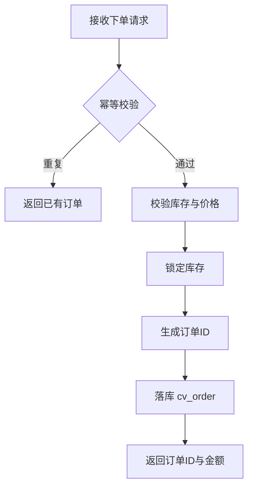

# 订单模块（order）
> 模块职责：管理订单的创建、支付、发货、取消、完成、退款等全生命周期
> 负责人：<填写 Agent 模型名>
> 关联表：cv_order、cv_order_item
> 关联服务：OrderService、PayService、StockService
> 系统模块：backend

## 订单新增
### 功能描述
用户下单，校验库存与价格后生成待支付订单，返回订单 ID 与应付金额。
业务规则：同一用户对同一商品 5 秒内重复提交视为一次（幂等）。

### 接口信息
| 项    | 值            |
| ----- | ------------- |
| method | POST         |
| path   | /api/order/create |
| 权限   | 登录用户      |

### 入参要求
| 参数名   | 类型 | 必填 | 校验规则         | 说明       |
| -------- | ---- | ---- | ---------------- | ---------- |
| shopId   | Long | 是   | > 0              | 所属店铺ID |
| skuId    | Long | 是   | > 0              | 商品SKU ID |
| quantity | Int  | 是   | 1 ≤ x ≤ 200      | 购买数量   |

请求体示例：
```json
{
	"shopId": 100234,
	"skuId": 88012,
	"quantity": 2
}
```

### 返回
| 字段    | 类型          | 说明          |
| ------- | ------------- | ------------- |
| orderId | Long          | 订单ID        |
| amount  | BigDecimal    | 应付金额(元)  |
| status  | String        | 订单状态      |

### 业务流程


### 异常与错误码
| 错误码 | 触发条件         | 提示文案       |
| ------ | ---------------- | -------------- |
| 40001  | 库存不足         | 商品库存不足   |
| 40002  | 价格已变动       | 价格已更新，请重新下单 |

### 数据库表/字段
- 主表 `cv_order`：`id`(订单ID)、`user_id`(下单用户ID)、`shop_id`(所属店铺ID)、`amount`(订单金额)、`status`(订单状态: 0-待支付 1-已支付 2-已发货 3-已完成 4-已取消)、`create_time`(创建时间)
- 明细表 `cv_order_item`：`id`、`order_id`(所属订单ID)、`sku_id`(商品SKU ID)、`quantity`(数量)、`price`(单价)

## 订单支付
### 功能描述
对订单进行支付，校验余额/支付渠道，扣款成功后更新订单状态。

### 接口信息
| 项    | 值            |
| ----- | ------------- |
| method | POST         |
| path   | /api/order/pay |
| 权限   | 登录用户      |

### 入参要求
| 参数名    | 类型 | 必填 | 说明       |
| --------- | ---- | ---- | ---------- |
| orderId   | Long | 是   | 订单ID     |
| payMethod | String | 是 | 支付方式（BALANCE/WECHAT/ALIPAY） |

### 返回
| 字段      | 类型   | 说明     |
| --------- | ------ | -------- |
| payResult | String | SUCCESS  |

### 异常与错误码
| 错误码 | 触发条件     | 提示文案     |
| ------ | ------------ | ------------ |
| 40103  | 余额不足     | 余额不足     |
| 40104  | 订单已支付   | 请勿重复支付 |
| 40105  | 订单已取消   | 订单已取消   |

## 订单取消
### 功能描述
取消待支付或已支付未发货的订单。取消后回补库存，已支付订单自动触发退款。

### 接口信息
| 项    | 值               |
| ----- | ---------------- |
| method | POST            |
| path   | /api/order/cancel |
| 权限   | 登录用户         |

### 入参要求
| 参数名  | 类型   | 必填 | 说明             |
| ------- | ------ | ---- | ---------------- |
| orderId | Long   | 是   | 订单ID           |
| reason  | String | 否   | 取消原因（选填） |

### 异常与错误码
| 错误码 | 触发条件         | 提示文案 |
| ------ | ---------------- | -------- |
| 40106  | 已发货订单取消   | 已发货订单无法取消，请申请退货 |
| 40107  | 已完成订单取消   | 已完成订单无法取消 |
