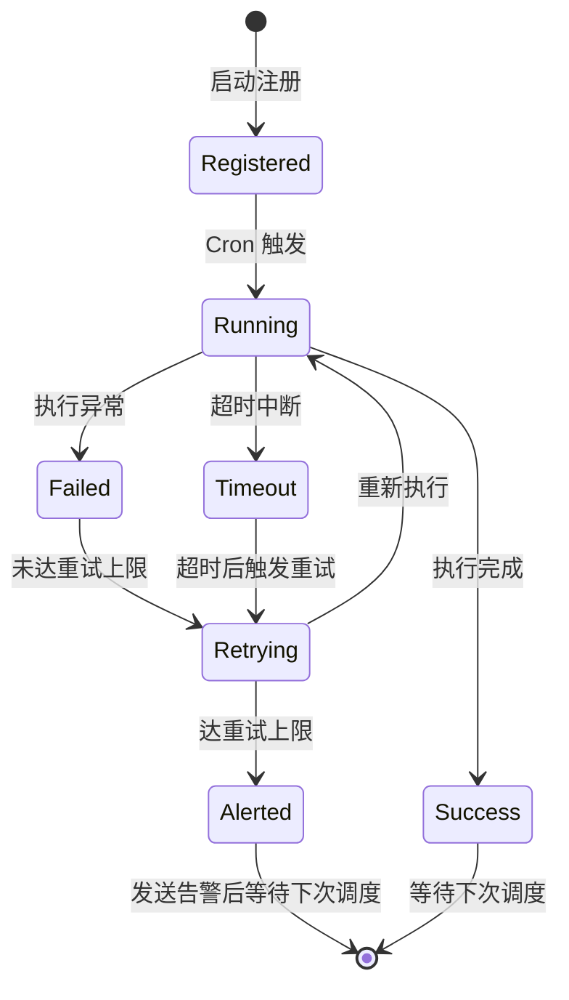

# 定时任务调度模块（scheduler）
> 模块职责：管理所有定时任务的注册、调度、执行、重试、告警
> 负责人：<填写 Agent 模型名>
> 关联表：daemon_job_log
> 关联服务：SchedulerService、JobExecutor
> 系统模块：daemon

## 功能描述
基于 Cron 表达式的定时任务调度器。负责任务注册、按 Cron 触发执行、失败重试、超时中断、并发互斥、告警通知。

## 技术选型
| 项       | 选型建议                                |
| -------- | --------------------------------------- |
| Go       | robfig/cron                             |
| Java     | Spring @Scheduled 或 Quartz             |
| Python   | APScheduler 或 Celery Beat              |

## 任务配置
```yaml
jobs:
  - name: "订单超时取消"
    cron: "*/5 * * * *"          # 每 5 分钟执行一次
    timeout: 120s                 # 单次执行超时时间
    retry: 3                     # 失败重试次数
    retryInterval: 60s          # 重试间隔
    mutex: true                  # 同一任务互斥（上次未完成则跳过本次）
```

## 任务生命周期


## 运行约束
- 同一时刻同一任务只允许一个实例运行（mutex=true）
- 不同任务之间并发执行，互不影响
- 单个 goroutine/线程 panic 不拖垮整个调度器
- 优雅关闭时等待当前批次完成再退出

## 异常与错误码
| 错误码 | 触发条件         | 处理方式       |
| ------ | ---------------- | -------------- |
| 50001  | 任务执行异常     | 按重试策略重试，上限后发送告警 |
| 50002  | 任务执行超时     | 中断任务，记录超时日志，触发重试 |
| 50003  | Cron 表达式无效  | 拒绝注册，启动失败 |

## 数据库表/字段
- 日志表 `daemon_job_log`：`id`、`job_name`(任务名)、`status`(SUCCESS/FAILED/TIMEOUT)、`start_time`(开始时间)、`end_time`(结束时间)、`error_msg`(错误信息)、`retry_count`(重试次数)
