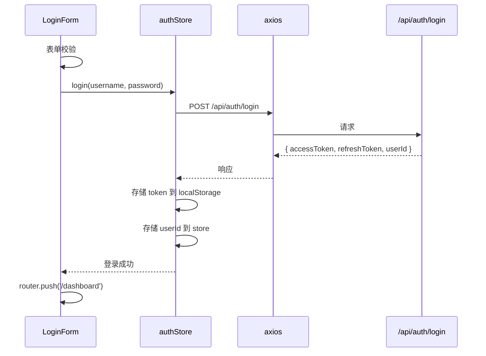

# 登录页（login）
> 模块职责：用户登录、注册、Token 存储、路由守卫、无感刷新
> 负责人：<填写 Agent 模型名>
> 关联页面：Dashboard、Register
> 关联类型：`src/types/auth.d.ts`
> 系统模块：frontend

## 登录表单
### 功能描述
用户输入用户名与密码，校验后提交后端认证。成功后将 token 存储到 localStorage 并跳转主页。

### 页面路径
| 路由    | 文件路径                    |
| ------- | --------------------------- |
| /login  | `src/views/Login/index.vue` |

### 组件层级
```
Login/
├── index.vue          # 页面入口（表单编排、提交逻辑）
└── components/
    ├── LoginForm/     # 登录表单（渲染 + 前端校验）
    └── QrCode/        # 扫码登录（如有）
```

### 页面状态
| 状态       | 触发条件       | UI 表现                         |
| ---------- | -------------- | ------------------------------- |
| 初始       | 页面首次加载   | 表单空白，登录按钮可用           |
| 校验错误   | 字段不合法     | 错误字段下方显示红色提示文案     |
| 提交中     | 点击登录后     | 登录按钮 loading，不可重复点击   |
| 登录成功   | 后端返回 token | Toast 提示成功，跳转 Dashboard   |
| 登录失败   | 后端返回 401   | Toast 提示错误信息，恢复按钮     |
| 网络异常   | 请求超时/断网  | Toast 提示网络异常，恢复按钮     |

### 数据流


### 异常处理
| 错误场景          | 处理方式                                       |
| ----------------- | ---------------------------------------------- |
| 表单字段为空      | 前端校验拦截，不发起请求                       |
| 用户名或密码错误  | 显示 Toast "用户名或密码错误"                    |
| 账号被锁定        | 显示 Toast "账号已锁定，请 N 分钟后重试"        |
| 网络异常          | 显示 Toast "网络异常，请检查网络连接"            |
| 服务器 500        | 显示 Toast "服务器异常，请稍后重试"              |

## 路由守卫
### 功能描述
- 未登录用户访问受保护页面 → 重定向到 /login
- 已登录用户访问 /login → 重定向到 /dashboard
- accessToken 过期 → 自动无感刷新
- refreshToken 过期 → 清除 token，重定向到 /login

### 无感刷新 Token
axios 响应拦截器统一处理：
1. 捕获 401 → 判断是否有 refreshToken
2. 有 → 调用 /api/auth/refresh 获取新 token
3. 并发请求用单飞（single-flight）队列避免重复刷新
4. 刷新成功 → 更新 token，重放原请求
5. 刷新失败 → 清除所有 token，跳转 /login
6. 已在 /login 页的 401 不触发刷新（避免循环）
