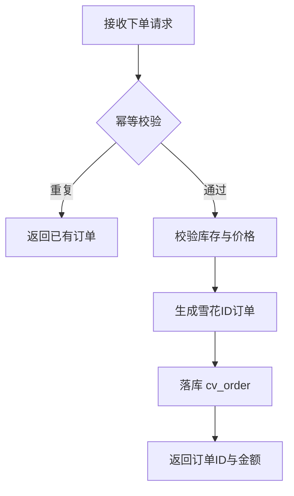
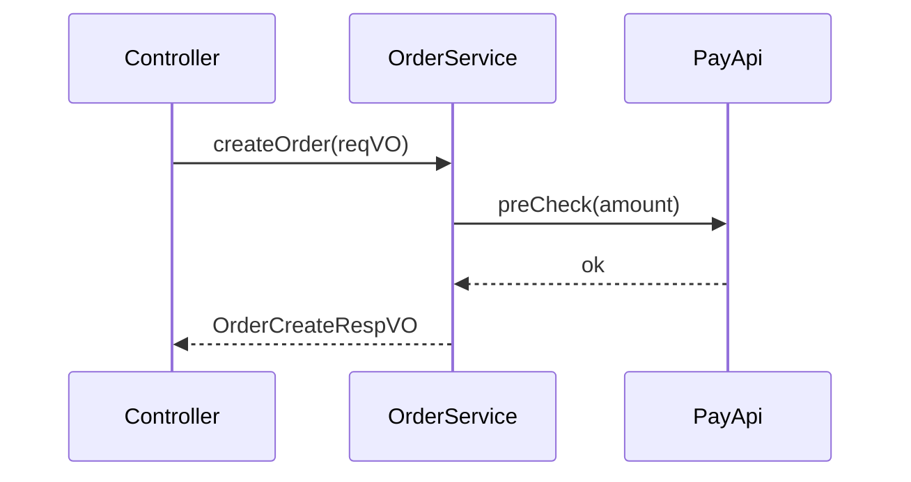

# Charles Coding -- 模块文档模板
> charles-coding 的模块文档规范。**先遵循 [SKILL.md](../SKILL.md) 的"全局约定"（尤其 Markdown 规范）。**

## 用途
- 编码前，每个模块必须先在 `docs/modules/` 下按**系统级模块**划分子目录写好文档并评审通过
- **目录结构**：`docs/modules/backend/<模块名>.md`、`docs/modules/frontend/<模块名>.md`、`docs/modules/daemon/<模块名>.md`，按实际项目增减系统模块（如 `docs/modules/backend/orders.md`）
- 一个模块一个 md，内含该模块的所有功能，每个功能一个二级标题
- 文档遵循本 Skill 全部 Markdown 约定：标题与正文间不空行、正文顶格（README 除外，此处为普通文档需正文顶格与否按项目，模块文档正文顶格即可）、禁用分割线

## 模板

````markdown
# 订单模块（orders）
> 模块职责：管理订单的创建、支付、发货、取消等全生命周期
> 负责人：<填写生成本文档的 Agent 模型名，如 Claude Opus 4.8>
> 系统模块：backend
> 关联表：cv_order、cv_order_item
> 关联服务：CvOrderService、CvPayApi

## 订单新增
### 功能描述
用户在下单页提交订单，校验库存与价格后生成待支付订单，返回订单ID与应付金额。
业务规则：同一用户对同一商品 5 秒内重复提交视为一次（幂等）。

### 接口信息
| 项    | 值            |
| ----- | ------------- |
| method | POST         |
| path   | /order/create |
| 权限   | 登录用户      |

### 入参要求
| 参数名   | 类型 | 必填 | 校验规则         | 说明       |
| -------- | ---- | ---- | ---------------- | ---------- |
| shopId   | Long | 是   | > 0              | 所属店铺ID |
| skuId    | Long | 是   | > 0              | 商品SKU ID |
| quantity | Int  | 是   | 1 ≤ x ≤ 200      | 购买数量   |

请求体（OrderCreateReqVO）示例：
```json
{
	"shopId": 100234,
	"skuId": 88012,
	"quantity": 2
}
```

### 返回
| 字段    | 类型          | 说明          |
| ------- | ------------- | ------------- |
| orderId | Long          | 订单ID        |
| amount  | BigDecimal    | 应付金额(元)  |

响应体（OrderCreateRespVO）示例：
```json
{
	"code": 0,
	"msg": "success",
	"data": {
		"orderId": 1875923001234567,
		"amount": 199.80
	}
}
```

### 业务流程


（涉及多服务交互时用时序图）


### 异常与错误码
| 错误码   | 触发条件         | 提示文案       |
| -------- | ---------------- | -------------- |
| 40001    | 库存不足         | 商品库存不足   |
| 40002    | 价格已变动       | 价格已更新，请重新下单 |

### 数据库表/字段
- 主表 `cv_order`：`id`(订单ID)、`user_id`(下单用户ID)、`shop_id`(所属店铺ID)、`amount`(订单金额)、`status`(订单状态)
- 明细表 `cv_order_item`：`id`、`order_id`(所属订单ID)、`sku_id`(商品SKU ID)、`quantity`(数量)
- 索引：`ix_cv_order_user_id`（按用户查订单）
````

## 编写要求
- **模块头信息一行一项**：模块职责、负责人、关联表、关联服务各占一行（用 `>` 引用块）
- **负责人填 Agent 模型名**（生成该文档的模型，如 `Claude Opus 4.8`），不是 Charles
- **流程图 / 时序图用 Mermaid** 表示（`flowchart` / `sequenceDiagram`），不用文字堆叠描述复杂流程
- **参数明细：表格 + JSON 示例** 两者都要 -- 表格讲清每个字段的类型/必填/校验/含义，JSON 给一个真实请求/响应样例
- 命名遵循 [SKILL.md](../SKILL.md) 数据传输规范：请求 `XxxReqVO`、响应 `XxxRespVO`
- SQL 相关遵循 [sql.md](sql.md)：主键雪花ID、COMMENT 写业务实体名
- 文档随功能变更**同步更新**，代码实现须与文档一致
